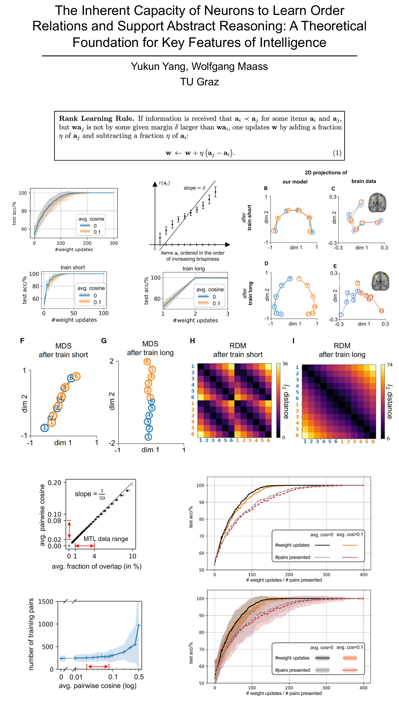

📄 [Click here to view full PDF](gitpage.pdf)

# Relationship Learning: Code Repository

This repository contains all Jupyter notebooks used to generate the figures and results reported in the manuscript.

---

## 1. System Requirements

- **Operating System**: Linux, macOS, or Windows  
- **Python Version**: 3.9 or 3.10  
- **Hardware**: Standard desktop or laptop with ≥8 GB RAM  

### Required Python Packages:

numpy==1.24  
scipy==1.10  
pandas==2.0  
matplotlib==3.7  
scikit-learn==1.2  
notebook==6.5  
networkx==3.1  

Install them with:

pip install -r requirements.txt

---

## 2. Installation Guide

1. Clone the repository:

git clone https://github.com/superrrpotato/Relationship-learning.git  
cd Relationship-learning

2. Create a virtual environment (recommended):

python3 -m venv env  
source env/bin/activate      # on Windows: env\Scripts\activate

3. Install dependencies:

pip install -r requirements.txt

Typical installation time: ~2–3 minutes on a standard desktop.

---

## 3. Demo

To reproduce the figures in the manuscript:

1. Launch Jupyter Notebook:

jupyter notebook

2. Open the notebooks in the following order and run **all** cells in each:

- Figure2+S1+S2.ipynb
- Figure3.ipynb  
- Figure4.ipynb
- Figure5.ipynb 

3. Each notebook generates intermediate results and visualizations.

Expected output: figures and numerical results from the paper  
Estimated runtime: ~5–10 minutes per notebook

---

## 4. Instructions for Use

You can adapt the notebooks to your own synthetic or real dataset by modifying the data generation sections (usually near the top of each notebook).

⚠ No external datasets are required. All data used is generated internally.

---

## 5. License

This project is licensed under the MIT License.  
See LICENSE for full terms.

---

## 6. Reproducibility

Running the notebooks in order reproduces all main results and plots presented in the manuscript.

---

## 7. Code Availability Statement

All source code, notebooks, and instructions are available at:  
https://github.com/superrrpotato/Relationship-learning
